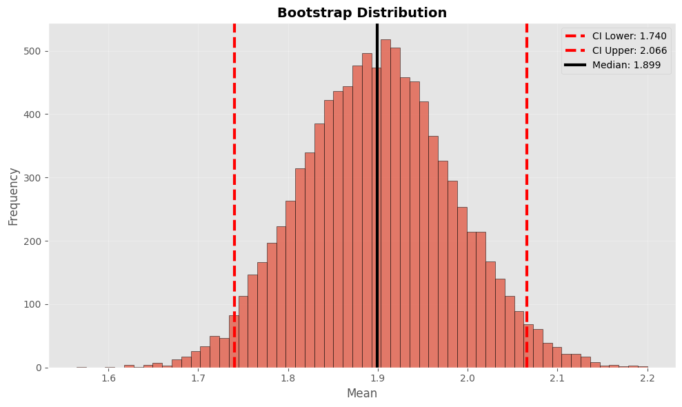
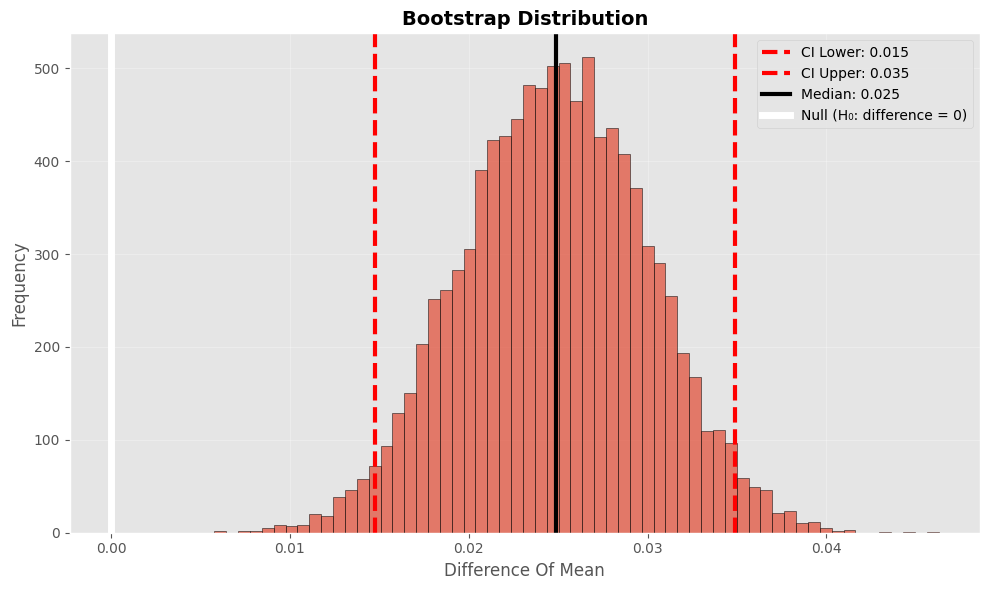
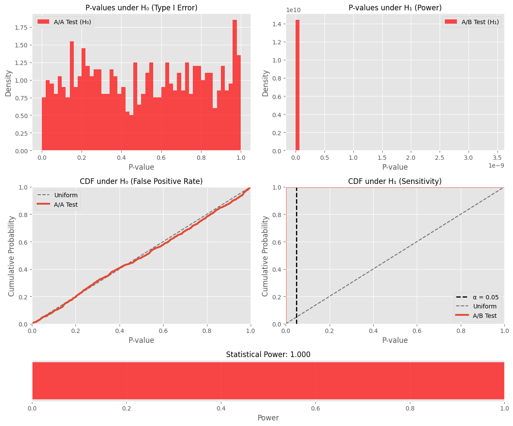
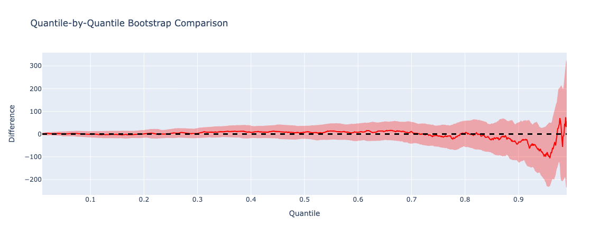

# FastBootstrap

<div align="center">

**⚡ Fast Python implementation of statistical bootstrap methods**

[](https://badge.fury.io/py/fastbootstrap)
[](https://www.python.org/downloads/release/python-3120/)
[](https://opensource.org/licenses/MIT)
[](https://github.com/psf/black)

*High-performance statistical bootstrap with parallel processing and comprehensive method support*

[Installation](#installation) • [Quick Start](#quick-start) • [Examples](#examples) • [Performance](#performance) • [API](#api-reference)

</div>

---

## 🚀 Features

- **Multiple Bootstrap Methods**: Percentile, BCa, Basic, Studentized, Spotify-style, and Poisson bootstrap
- **High Performance**: Parallel processing with joblib, optimized NumPy operations
- **Comprehensive Statistics**: Confidence intervals, p-values, effect sizes, power analysis, quantile-quantile analysis
- **Flexible API**: Unified interface with method auto-selection
- **Rich Visualizations**: Built-in plotting with matplotlib and plotly
- **Production Ready**: Extensive error handling, type hints

## 📦 Installation

```bash
pip install fastbootstrap
```

### 🛠️ Development Setup

```bash
git clone https://github.com/timofeytkachenko/fastbootstrap.git
cd fastbootstrap
pip install -e ".[dev]"
pre-commit install
```

## 🎯 Quick Start

```python
import numpy as np
import fastbootstrap as fb

# Generate sample data
np.random.seed(42)
control = np.random.normal(100, 15, 1000)      # Control group
treatment = np.random.normal(105, 15, 1000)    # Treatment group (+5% effect)

# Two-sample bootstrap test
result = fb.two_sample_bootstrap(control, treatment, plot=True)
print(f"P-value: {result['p_value']:.4f}")
print(f"Effect size: {result['statistic_value']:.2f}")
print(f"95% CI: [{result['confidence_interval'][0]:.2f}, {result['confidence_interval'][1]:.2f}]")
```

## 📊 Examples

### One-Sample Bootstrap

Estimate confidence intervals for a single sample statistic:

```python
import fastbootstrap as fb
import numpy as np

# Sample data
sample = np.random.exponential(2, 500)

# Basic percentile bootstrap
result = fb.one_sample_bootstrap(
    sample,
    statistic=np.mean,
    method='percentile',
    bootstrap_conf_level=0.95,
    number_of_bootstrap_samples=10000,
    plot=True
)

print(f"Mean estimate: {result['statistic_value']:.3f}")
print(f"95% CI: [{result['confidence_interval'][0]:.3f}, {result['confidence_interval'][1]:.3f}]")

# Advanced: BCa (Bias-Corrected and Accelerated) bootstrap
bca_result = fb.one_sample_bootstrap(
    sample,
    method='bca',
    statistic=np.median,
    plot=True
)
```



### Two-Sample Comparison

Compare two groups with various statistics:

```python
import fastbootstrap as fb
import numpy as np

# A/B test data
control = np.random.normal(0.25, 0.1, 800)     # 25% conversion rate
treatment = np.random.normal(0.28, 0.1, 800)   # 28% conversion rate

# Test difference in means
result = fb.two_sample_bootstrap(
    control,
    treatment,
    statistic=fb.difference_of_mean,
    number_of_bootstrap_samples=10000,
    plot=True
)

print(f"Difference in conversion rates: {result['statistic_value']:.1%}")
print(f"P-value: {result['p_value']:.4f}")
print(f"Significant: {'Yes' if result['p_value'] < 0.05 else 'No'}")

# Test percentage change
percent_result = fb.two_sample_bootstrap(
    control,
    treatment,
    statistic=fb.percent_change_of_mean
)
print(f"Percentage change: {percent_result['statistic_value']:.1%}")
```



### Spotify-Style Bootstrap

Fast quantile-based bootstrap using binomial sampling:

```python
import fastbootstrap as fb
import numpy as np

# Revenue data (heavy-tailed distribution)
control_revenue = np.random.lognormal(3, 1, 1000)
treatment_revenue = np.random.lognormal(3.1, 1, 1000)

# Compare medians (50th percentile)
result = fb.spotify_two_sample_bootstrap(
    control_revenue,
    treatment_revenue,
    q1=0.5,  # Median
    q2=0.5,
    plot=True
)

print(f"Median difference: ${result['statistic_value']:.2f}")
print(f"P-value: {result['p_value']:.4f}")

# Compare different quantiles
p90_result = fb.spotify_two_sample_bootstrap(
    control_revenue,
    treatment_revenue,
    q1=0.9,  # 90th percentile
    q2=0.9
)
print(f"90th percentile difference: ${p90_result['statistic_value']:.2f}")
```

### Power Analysis & Simulation

Comprehensive statistical power analysis:

```python
import numpy as np
import fastbootstrap as fb

# Simulate experiment data
control = np.random.normal(100, 20, 500)
treatment = np.random.normal(110, 20, 500)  # 10% effect size

# Power analysis
power_result = fb.power_analysis(
    control,
    treatment,
    number_of_experiments=1000,
    plot=True
)

print("Power Analysis Results:")
print(f"Statistical Power: {power_result['power_summary']['statistical_power']:.3f}")
print(f"Type I Error Rate: {power_result['power_summary']['type_i_error_rate']:.3f}")
print(f"Effect Size: {power_result['power_summary']['treatment_mean'] - power_result['power_summary']['control_mean']:.1f}")

# A/A test validation (should show ~5% false positive rate)
aa_result = fb.aa_test_simulation(
    np.concatenate([control, treatment]),
    number_of_experiments=2000
)
print(f"A/A Test False Positive Rate: {aa_result['type_i_error_rate']:.3f}")
```



### Quantile-Quantile Analysis

```python
import numpy as np
import fastbootstrap as fb

# Simulate experiment data
control = np.random.exponential(scale=1 / 0.001, size=n)
treatment = np.random.exponential(scale=1 / 0.00101, size=n)

# Quantile-quantile bootstrap analysis
fb.quantile_bootstrap_plot(control, treatment, n_step=1000)
```



### Custom Statistics

Bootstrap with simple custom statistical functions:

```python
import numpy as np
import fastbootstrap as fb

# Simple custom statistics
def max_difference(x, y):
    """Difference in maximum values."""
    return np.max(y) - np.max(x)

def range_ratio(x, y):
    """Ratio of ranges."""
    range_x = np.max(x) - np.min(x)
    range_y = np.max(y) - np.min(y)
    return range_y / range_x

def mean_ratio(x, y):
    """Ratio of means."""
    return np.mean(y) / np.mean(x)

# Apply custom statistics
control = np.random.normal(50, 10, 300)
treatment = np.random.normal(55, 12, 300)

# Test different custom statistics
max_result = fb.two_sample_bootstrap(control, treatment, statistic=max_difference)
range_result = fb.two_sample_bootstrap(control, treatment, statistic=range_ratio)
ratio_result = fb.two_sample_bootstrap(control, treatment, statistic=mean_ratio)

print(f"Max Difference: {max_result['statistic_value']:.2f}")
print(f"Range Ratio: {range_result['statistic_value']:.3f}")
print(f"Mean Ratio: {ratio_result['statistic_value']:.3f}")
```

### Unified Bootstrap Interface

Automatic method selection based on input:

```python
import numpy as np
import fastbootstrap as fb

# One-sample (automatic detection)
sample = np.random.gamma(2, 2, 400)
result = fb.bootstrap(sample, statistic=np.mean, method='bca')

# Two-sample (automatic detection)
control = np.random.normal(0, 1, 300)
treatment = np.random.normal(0.3, 1, 300)
result = fb.bootstrap(control, treatment)

# Spotify-style (automatic detection)
result = fb.bootstrap(control, treatment, spotify_style=True, q=0.5)
```

## ⚡ Performance Benchmarks

Performance benchmarks on Apple Silicon M1 Pro (results may vary by system):

### Standard Configuration (n=1,000, bootstrap=10,000)

| Method | Time (seconds) | Bootstrap/sec |
|--------|----------------|---------------|
| Spotify One Sample | 0.001 | 19,717,384 |
| Spotify Two Sample | 0.001 | 9,099,065 |
| One Sample Basic | 0.219 | 45,685 |
| One Sample Percentile | 0.224 | 44,601 |
| Two Sample Standard | 0.230 | 43,471 |
| One Sample Studentized | 0.234 | 42,752 |
| One Sample Bca | 0.243 | 41,201 |
| Poisson Bootstrap | 0.298 | 33,581 |

### Key Performance Insights

- **Fastest Method**: Spotify One Sample (0.001s) - optimized quantile-based approach
- **Multithreading**: Leverages joblib for parallel bootstrap sample generation across CPU cores
- **Parallel Processing**: Automatically scales to utilize all available CPU cores for optimal performance
- **Memory Efficient**: O(n) space complexity with minimal memory overhead for large datasets
- **Vectorized Operations**: NumPy-optimized computations for maximum throughput
- **Scalability**: Linear scaling with sample size and bootstrap iterations, sublinear with CPU cores

## 🔧 API Reference

### Core Functions

#### `bootstrap(control, treatment=None, **kwargs)`
Unified bootstrap interface with automatic method selection.

#### `one_sample_bootstrap(sample, **kwargs)`
Single-sample bootstrap for confidence intervals.

#### `two_sample_bootstrap(control, treatment, **kwargs)`
Two-sample bootstrap for group comparisons.

#### `spotify_one_sample_bootstrap(sample, q=0.5, **kwargs)`
Fast quantile bootstrap using binomial sampling.

#### `spotify_two_sample_bootstrap(control, treatment, q1=0.5, q2=0.5, **kwargs)`
Fast two-sample quantile comparison.

### Parameters

| Parameter | Type | Default | Description |
|-----------|------|---------|-------------|
| `bootstrap_conf_level` | float | 0.95 | Confidence level (0-1) |
| `number_of_bootstrap_samples` | int | 10000 | Bootstrap iterations |
| `method` | str | 'percentile' | Bootstrap method |
| `statistic` | callable | `np.mean` | Statistical function |
| `seed` | int | 42 | Random seed |
| `plot` | bool | False | Generate plots |

### Bootstrap Methods

- **percentile**: Basic percentile method
- **bca**: Bias-corrected and accelerated
- **basic**: Basic bootstrap
- **studentized**: Studentized bootstrap

### Statistical Functions

- `difference_of_mean`, `difference_of_median`, `difference_of_std`
- `percent_change_of_mean`, `percent_change_of_median`
- `percent_difference_of_mean`, `percent_difference_of_median`

---

<div align="center">

**[⭐ Star us on GitHub](https://github.com/timofeytkachenko/fastbootstrap)** • **[📖 Full Documentation](https://nbviewer.org/github/timofeytkachenko/fastbootstrap/blob/main/bootstrap_experiment.ipynb)**

</div>
