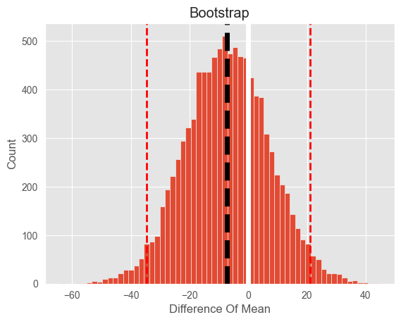

# fastbootstrap
Fast Python implementation of statistical bootstrap
___
## Installation
```bash
pip install fastbootstrap
```
___
## Usage
```python
import numpy as np
from fastbootstrap.bootstrap import two_sample_bootstrap

n = 10000

sample_1 = np.random.exponential(scale=1 / 0.001, size=n)
sample_2 = np.random.exponential(scale=1 / 0.00101, size=n)

p_value, boot_mean, boot_conf_interval, boot_dist = two_sample_bootstrap(sample_1, sample_2, plot=True)
```

___
Check interactive notebook [here](https://nbviewer.org/github/timofeytkachenko/bootstrap/blob/main/bootstrap_experiment.ipynb)
