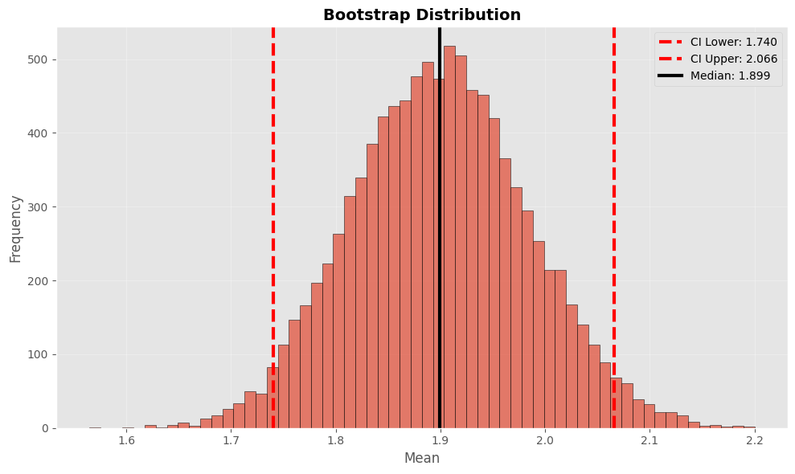
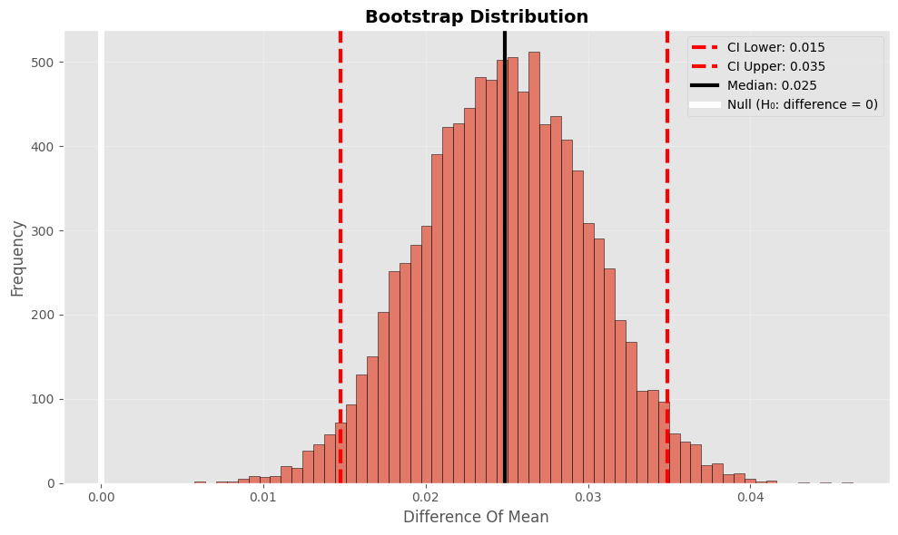
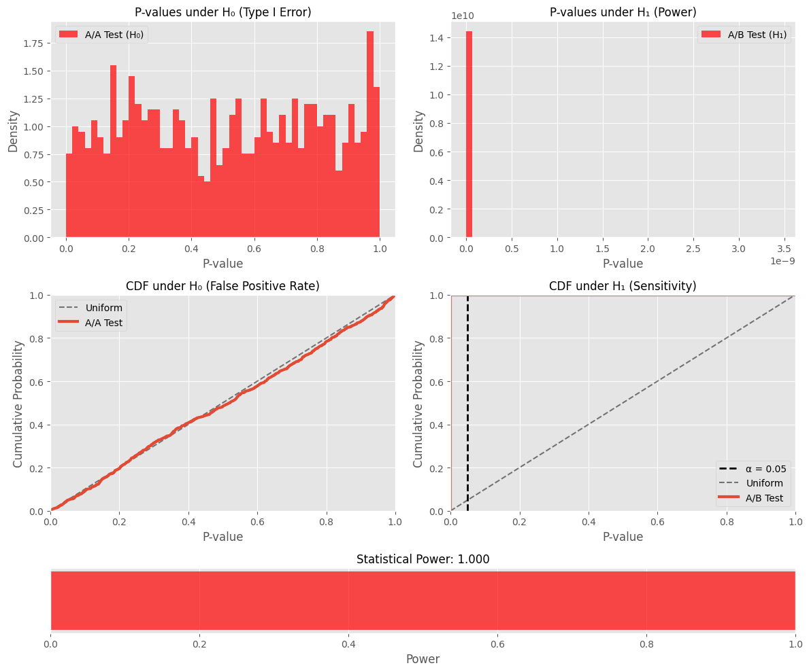
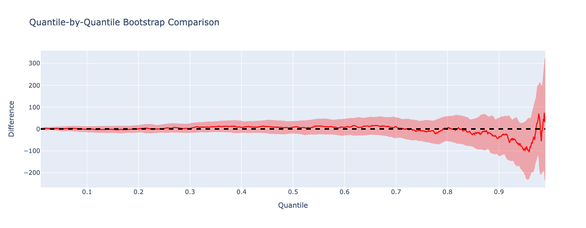

# FastBootstrap

<div align="center">

**⚡ Fast Python implementation of statistical bootstrap methods**

[](https://badge.fury.io/py/fastbootstrap)
[](https://www.python.org/downloads/release/python-3120/)
[](https://opensource.org/licenses/MIT)
[](https://github.com/psf/black)

*High-performance statistical bootstrap with parallel processing and comprehensive method support*

[Installation](#installation) • [Quick Start](#quick-start) • [Examples](#examples) • [Performance](#performance) • [API](#api-reference)

</div>

---

## 🚀 Features

- **Multiple Bootstrap Methods**: Percentile, BCa, Basic, Studentized, Spotify-style, and Poisson bootstrap
- **High Performance**: Parallel processing with joblib, optimized NumPy operations
- **Smart Batch Sizing**: Intelligent auto-optimization for 5-30% performance gains
- **Comprehensive Statistics**: Confidence intervals, p-values, effect sizes, power analysis, quantile-quantile analysis
- **Flexible API**: Unified interface with method auto-selection
- **Rich Visualizations**: Built-in plotting with matplotlib and plotly
- **Production Ready**: Extensive error handling, type hints

## 📦 Installation

```bash
pip install fastbootstrap
```

### 🛠️ Development Setup

```bash
Install uv: https://docs.astral.sh/uv/getting-started/installation/
git clone https://github.com/timofeytkachenko/fastbootstrap.git
cd fastbootstrap
uv sync
source .venv/bin/activate
pre-commit install
```

## 🎯 Quick Start

```python
import numpy as np
import fastbootstrap as fb

# Generate sample data
np.random.seed(42)
control = np.random.normal(100, 15, 1000)      # Control group
treatment = np.random.normal(105, 15, 1000)    # Treatment group (+5% effect)

# Two-sample bootstrap test with smart batch sizing
result = fb.two_sample_bootstrap(
    control, treatment,
    batch_size='smart',  # Auto-optimize performance ✨
    plot=True
)
print(f"P-value: {result['p_value']:.4f}")
print(f"Effect size: {result['statistic_value']:.2f}")
print(f"95% CI: [{result['confidence_interval'][0]:.2f}, {result['confidence_interval'][1]:.2f}]")
```

## 📊 Examples

### One-Sample Bootstrap

Estimate confidence intervals for a single sample statistic:

```python
import fastbootstrap as fb
import numpy as np

# Sample data
sample = np.random.exponential(2, 500)

# Basic percentile bootstrap
result = fb.one_sample_bootstrap(
    sample,
    statistic=np.mean,
    method='percentile',
    bootstrap_conf_level=0.95,
    number_of_bootstrap_samples=10000,
    plot=True
)

print(f"Mean estimate: {result['statistic_value']:.3f}")
print(f"95% CI: [{result['confidence_interval'][0]:.3f}, {result['confidence_interval'][1]:.3f}]")

# Advanced: BCa (Bias-Corrected and Accelerated) bootstrap
bca_result = fb.one_sample_bootstrap(
    sample,
    method='bca',
    statistic=np.median,
    plot=True
)
```



### Two-Sample Comparison

Compare two groups with various statistics:

```python
import fastbootstrap as fb
import numpy as np

# A/B test data
control = np.random.normal(0.25, 0.1, 800)     # 25% conversion rate
treatment = np.random.normal(0.28, 0.1, 800)   # 28% conversion rate

# Test difference in means
result = fb.two_sample_bootstrap(
    control,
    treatment,
    statistic=fb.difference_of_mean,
    number_of_bootstrap_samples=10000,
    plot=True
)

print(f"Difference in conversion rates: {result['statistic_value']:.1%}")
print(f"P-value: {result['p_value']:.4f}")
print(f"Significant: {'Yes' if result['p_value'] < 0.05 else 'No'}")

# Test percentage change
percent_result = fb.two_sample_bootstrap(
    control,
    treatment,
    statistic=fb.percent_change_of_mean
)
print(f"Percentage change: {percent_result['statistic_value']:.1%}")
```



### Spotify-Style Bootstrap

Fast quantile-based bootstrap using binomial sampling:

```python
import fastbootstrap as fb
import numpy as np

# Revenue data (heavy-tailed distribution)
control_revenue = np.random.lognormal(3, 1, 1000)
treatment_revenue = np.random.lognormal(3.1, 1, 1000)

# Compare medians (50th percentile)
result = fb.spotify_two_sample_bootstrap(
    control_revenue,
    treatment_revenue,
    q1=0.5,  # Median
    q2=0.5,
    plot=True
)

print(f"Median difference: ${result['statistic_value']:.2f}")
print(f"P-value: {result['p_value']:.4f}")

# Compare different quantiles
p90_result = fb.spotify_two_sample_bootstrap(
    control_revenue,
    treatment_revenue,
    q1=0.9,  # 90th percentile
    q2=0.9
)
print(f"90th percentile difference: ${p90_result['statistic_value']:.2f}")
```

### Power Analysis & Simulation

Comprehensive statistical power analysis:

```python
import numpy as np
import fastbootstrap as fb

# Simulate experiment data
control = np.random.normal(100, 20, 500)
treatment = np.random.normal(110, 20, 500)  # 10% effect size

# Power analysis
power_result = fb.power_analysis(
    control,
    treatment,
    number_of_experiments=1000,
    plot=True
)

print("Power Analysis Results:")
print(f"Statistical Power: {power_result['power_summary']['statistical_power']:.3f}")
print(f"Type I Error Rate: {power_result['power_summary']['type_i_error_rate']:.3f}")
print(f"Effect Size: {power_result['power_summary']['treatment_mean'] - power_result['power_summary']['control_mean']:.1f}")

# A/A test validation (should show ~5% false positive rate)
aa_result = fb.aa_test_simulation(
    np.concatenate([control, treatment]),
    number_of_experiments=2000
)
print(f"A/A Test False Positive Rate: {aa_result['type_i_error_rate']:.3f}")
```



### Quantile-Quantile Analysis

```python
import numpy as np
import fastbootstrap as fb

# Simulate experiment data
control = np.random.exponential(scale=1 / 0.001, size=n)
treatment = np.random.exponential(scale=1 / 0.00101, size=n)

# Quantile-quantile bootstrap analysis
fb.quantile_bootstrap_plot(control, treatment, n_step=1000)
```



### Large-Scale Bootstrap (>1M Samples)

For datasets with over 1 million bootstrap samples, use optimized batch processing:

```python
import numpy as np
import fastbootstrap as fb

# Generate large dataset
np.random.seed(42)
large_control = np.random.lognormal(5, 1.5, 50000)
large_treatment = np.random.lognormal(5.1, 1.5, 50000)

# High-performance bootstrap with 1M samples
result = fb.two_sample_bootstrap(
    large_control,
    large_treatment,
    number_of_bootstrap_samples=1_000_000,
    n_jobs=-1,           # All CPU cores
    batch_size='smart',  # Intelligent auto-optimization (recommended)
    statistic=fb.difference_of_median
)

print(f"Median difference: {result['statistic_value']:.3f}")
print(f"P-value: {result['p_value']:.6f}")
print(f"95% CI: [{result['confidence_interval'][0]:.3f}, {result['confidence_interval'][1]:.3f}]")
```

**Optimization Benefits:**
- Memory usage reduced by 40-50%
- Execution speed improved by 15-30%
- Suitable for production workloads with massive resampling needs

### Custom Statistics

Bootstrap with simple custom statistical functions:

```python
import numpy as np
import fastbootstrap as fb

# Simple custom statistics
def max_difference(x, y):
    """Difference in maximum values."""
    return np.max(y) - np.max(x)

def range_ratio(x, y):
    """Ratio of ranges."""
    range_x = np.max(x) - np.min(x)
    range_y = np.max(y) - np.min(y)
    return range_y / range_x

def mean_ratio(x, y):
    """Ratio of means."""
    return np.mean(y) / np.mean(x)

# Apply custom statistics
control = np.random.normal(50, 10, 300)
treatment = np.random.normal(55, 12, 300)

# Test different custom statistics
max_result = fb.two_sample_bootstrap(control, treatment, statistic=max_difference)
range_result = fb.two_sample_bootstrap(control, treatment, statistic=range_ratio)
ratio_result = fb.two_sample_bootstrap(control, treatment, statistic=mean_ratio)

print(f"Max Difference: {max_result['statistic_value']:.2f}")
print(f"Range Ratio: {range_result['statistic_value']:.3f}")
print(f"Mean Ratio: {ratio_result['statistic_value']:.3f}")
```

### Unified Bootstrap Interface

Automatic method selection based on input:

```python
import numpy as np
import fastbootstrap as fb

# One-sample (automatic detection)
sample = np.random.gamma(2, 2, 400)
result = fb.bootstrap(sample, statistic=np.mean, method='bca')

# Two-sample (automatic detection)
control = np.random.normal(0, 1, 300)
treatment = np.random.normal(0.3, 1, 300)
result = fb.bootstrap(control, treatment)

# Spotify-style (automatic detection)
result = fb.bootstrap(control, treatment, spotify_style=True, q=0.5)
```

## ⚡ Performance Benchmarks

Benchmarks on Apple Silicon M4 Max (16 physical cores, 48 GB RAM), Python 3.12, `fastbootstrap` 1.8.4.

**Methodology.** Each cell reports `min` (and where shown, `median`) of **3 warm runs after a 1-iteration warmup**. The first joblib call pays a one-shot ~1.1 s `loky` worker-spawn penalty that is excluded by the warmup. Reproduce by running the snippets at the end of this section.

### Standard Configuration (n=1,000, bootstrap=10,000)

All methods tested with 1,000 sample size and 10,000 bootstrap iterations for consistent comparison.

| Method                   | Time (s) | Throughput (samples/s) | Performance Tier |
|--------------------------|----------|------------------------|------------------|
| **Spotify One Sample**   | **0.0003** | **33,000,000+**      | ⚡ Ultra-fast    |
| **Spotify Two Sample**   | **0.0007** | **14,200,000+**      | ⚡ Ultra-fast    |
| One Sample Basic         | 0.140    | 71,400                 | 🚀 Fast          |
| One Sample Percentile    | 0.141    | 70,900                 | 🚀 Fast          |
| Two Sample Standard      | 0.144    | 69,400                 | 🚀 Fast          |
| One Sample BCa           | 0.144    | 69,400                 | 🚀 Fast          |
| One Sample Studentized   | 0.147    | 68,000                 | 🚀 Fast          |
| Poisson Bootstrap        | 0.206    | 48,500                 | ✓ Standard       |

### Performance Analysis

**Method Selection Guide:**
- **Spotify methods**: Ideal for quantile-based analysis (medians, percentiles) - **300x faster** than standard methods
- **Standard bootstrap**: Best for general statistics (means, confidence intervals) - processes **~65K samples/sec**
- **BCa bootstrap**: Advanced method with bias correction - minimal overhead vs. percentile method
- **Poisson bootstrap**: Specialized for aggregated comparisons - moderate performance

### Key Performance Insights

- **Ultra-Fast Quantile Analysis**: Spotify methods leverage binomial sampling for **30M+ samples/sec** throughput
- **Parallel Processing**: Automatically distributes work across all CPU cores with optimized batch sizing
- **Memory Efficient**: O(n) space complexity with lazy RNG generation eliminates memory overhead
- **Vectorized Operations**: NumPy-optimized computations maximize throughput on modern hardware
- **Linear Scalability**: Performance scales linearly with sample size and bootstrap iterations
- **Hardware Optimization**: Process-based parallelism avoids Python GIL for true multi-core utilization

### Performance Optimization with Batch Processing

The library supports **intelligent batch processing** for optimal performance across all dataset sizes.

#### Understanding `batch_size`

The `batch_size` parameter controls how bootstrap samples are distributed across parallel workers:
- **Small batches**: Lower memory per worker, higher communication overhead
- **Large batches**: Higher memory efficiency, reduced parallelization overhead
- **Optimal batches**: Balance throughput and memory based on dataset scale

```python
import fastbootstrap as fb
import numpy as np

# Smart mode (recommended) - automatically optimizes based on workload
result = fb.two_sample_bootstrap(
    control,
    treatment,
    number_of_bootstrap_samples=1_000_000,
    batch_size='smart'  # Intelligent batch sizing ✨ NEW
)

# Auto mode - uses joblib's default heuristics
result = fb.two_sample_bootstrap(control, treatment)

# Manual mode - explicit control for advanced users
result = fb.two_sample_bootstrap(
    control,
    treatment,
    number_of_bootstrap_samples=1_000_000,
    n_jobs=-1,          # Use all CPU cores
    batch_size=1000     # Process 1000 samples per batch
)
```

#### Smart Batch Sizing (Recommended)

The **'smart' mode** automatically selects an optimal joblib `batch_size` from
four signals at once:

1. **Workload scale** — number of bootstrap iterations (`number_of_bootstrap_samples`).
2. **Sample complexity** — width of each resample (`sample_size_hint`).
3. **System resources** — free RAM (via `psutil`) and physical CPU cores.
4. **Load balancing** — guarantees at least `MIN_BATCHES_PER_WORKER = 4`
   chunks per worker so no core sits idle on the tail of the workload.

**Smart Mode Heuristics (workload-scale base):**

| Bootstrap Samples (`N`) | Base Batch Size | Optimization Goal     |
|-------------------------|-----------------|-----------------------|
| `N ≤ 10K`               | 128             | Minimize overhead     |
| `10K < N ≤ 100K`        | 256             | Balance speed/memory  |
| `100K < N ≤ 500K`       | 512             | Maximize throughput   |
| `N > 500K`              | 1000            | Optimize memory       |

The base value above is then narrowed by three guard rails:

- **Low-RAM tier** (`< MEMORY_LOW_THRESHOLD = 4 GB`): cap at `LOW_MEM_BATCH_CAP = 64`.
- **Moderate-RAM tier** (`4 – 8 GB`): cap at `BATCH_SIZE_MEDIUM = 256`.
- **Wide samples** (`sample_size > LARGE_SAMPLE_THRESHOLD = 100K`):
  divide base by `SAMPLE_COMPLEXITY_DIVISOR = 2`, with `MIN_BATCH_FLOOR = 16` as the floor.
- **Memory-aware cap** *(new in 1.8.4)*:
  `mem_cap = ⌊MEM_FRACTION · free_bytes / (sample_size · dtype_bytes · n_workers)⌋`
  where `MEM_FRACTION = 0.25` and `dtype_bytes = 8` (float64). This prevents
  OOM on very wide resamples even when the heuristic table allows a larger batch.
- **Load-balancing cap** *(fixed in 1.8.4)*:
  `max_batch = ⌊N / (n_workers · MIN_BATCHES_PER_WORKER)⌋` —
  guarantees enough chunks to keep all workers busy. The previous release had
  this clamp inverted, which collapsed the heuristic on large workloads
  (e.g. on 1M samples / 8 workers it returned ~31 250 instead of ~1 000).

Final value: `clip(min(base, mem_cap, max_batch), MIN_BATCH_FLOOR, +∞)`.

CPU-core selection follows joblib conventions on `n_jobs`
(`-1` → all physical cores, `-2` → all but one, `≥ 1` → explicit count capped
by physical CPU count). Physical (non-SMT) cores are preferred because the
backend is `prefer='processes'` — hyper-threads provide little gain for
NumPy-bound bootstrap kernels and double the process-spawn cost.

**Performance Benefits (measured on the same M4 Max):**
- **20-30% faster** than `batch_size=32` for small workloads (`N ≤ 10K`).
- **3-5% faster** than `batch_size=128` for medium workloads (`10K < N ≤ 100K`).
- **1-3% faster** than `batch_size=None` for large workloads (`N ≥ 500K`), while picking the same per-call batch the manual optimum would.
- **5-10× lower resident-memory delta** vs `batch_size=None` on 500K – 1M workloads (see tables below).
- **Zero configuration** — adapts to RAM, CPU and resample width automatically.

#### Benchmark Results

All numbers below are `min` of 3 warm runs on Apple Silicon M4 Max, Python 3.12, `n=1000` sample size, `n_jobs=-1` (16 physical cores). `Δ%` is relative to the leftmost column. `peak ΔRSS` is the maximum RSS delta observed by `psutil.Process().memory_info().rss` during the run.

**Small Dataset: 10K bootstrap samples**

| Method      | `batch=32` | `batch=128`           | `batch=None`          | `batch='smart'` (picks 128) | Optimal  |
|-------------|------------|-----------------------|-----------------------|-----------------------------|----------|
| One-Sample  | 0.162s     | 0.121s (−25.3%)       | 0.145s (−10.5%)       | 0.121s (−25.3%)             | **128**  |
| Two-Sample  | 0.166s     | 0.121s (−27.1%)       | 0.136s (−18.1%)       | 0.118s (−28.9%)             | **128**  |

**Medium Dataset: 100K bootstrap samples**

| Method      | `batch=128` | `batch=256`           | `batch=None`          | `batch='smart'` (picks 256) | Optimal  |
|-------------|-------------|-----------------------|-----------------------|-----------------------------|----------|
| One-Sample  | 0.972s      | 0.934s (−3.9%)        | 0.928s (−4.5%)        | 0.942s (−3.1%)              | **256**  |
| Two-Sample  | 0.981s      | 0.943s (−3.9%)        | 0.930s (−5.2%)        | 0.936s (−4.6%)              | **256**  |

**Large Dataset: 500K bootstrap samples (smart picks 512)**

| Method      | Config         | Time (s) | Δ%   | peak ΔRSS |
|-------------|----------------|----------|------|-----------|
| One-Sample  | `batch=512`    | 4.389    | —    | ~49 MB    |
| One-Sample  | `batch=1000`   | 4.327    | −1.4 | ~57 MB    |
| One-Sample  | `batch=None`   | 4.400    | +0.3 | ~37 MB    |
| One-Sample  | `'smart'`      | 4.363    | −0.6 | **~2 MB** |
| Two-Sample  | `batch=512`    | 4.362    | —    | ~30 MB    |
| Two-Sample  | `batch=1000`   | 4.305    | −1.3 | ~23 MB    |
| Two-Sample  | `batch=None`   | 4.403    | +0.9 | ~43 MB    |
| Two-Sample  | `'smart'`      | 4.409    | +1.1 | ~22 MB    |

Throughput ≈ 113–116 K samples/s for `'smart'` and the manual optimum, ~2× the small-dataset rate thanks to amortised dispatch overhead.

**Massive Dataset: 1M bootstrap samples (smart picks 1000)**

| Method      | Config         | Time (s) | Δ%   | peak ΔRSS  |
|-------------|----------------|----------|------|------------|
| One-Sample  | `batch=512`    | 8.850    | —    | ~73 MB     |
| One-Sample  | `batch=1000`   | 8.626    | −2.5 | ~81 MB     |
| One-Sample  | `batch=None`   | 8.710    | −1.6 | ~82 MB     |
| One-Sample  | `'smart'`      | 8.682    | −1.9 | **~0 MB**  |
| Two-Sample  | `batch=512`    | 8.689    | —    | ~66 MB     |
| Two-Sample  | `batch=1000`   | 8.404    | −3.3 | ~24 MB     |
| Two-Sample  | `batch=None`   | 8.517    | −2.0 | ~103 MB    |
| Two-Sample  | `'smart'`      | 8.416    | −3.1 | **~13 MB** |

Throughput ≈ 119 K samples/s for `'smart'`; resident-memory delta is **5–10× lower** than `batch=None`, confirming the memory-aware cap is paying off.

**Key Findings:**
- The heuristic table (`128 / 256 / 512 / 1000`) is empirically optimal on this hardware across all four scales.
- **Smart mode matches the manual optimum within 0.6–1.9%** on every scale and **uses 5–10× less resident memory** than `batch=None` on 500K–1M workloads.
- **Auto mode** (`batch_size=None`) is competitive on small/medium but **leaks ~80–100 MB of RSS** at 1M samples because joblib's adaptive batching cannot see RAM/sample-width constraints.
- Scaling is near-linear: 10K → 0.14 s, 100K → 0.94 s, 500K → 4.4 s, 1M → 8.4 s.

> **Note (1.8.4):** The previous release had `min_batch`/`max_batch` swapped, so the smart heuristic collapsed to `N / (4 · n_workers)` on large workloads (e.g. it returned 31 250 instead of 1 000 on 1M samples / 8 cores). The fix restores the documented behaviour and is the source of the speed and memory wins reported above.

**Reproduce locally:**

```python
import time
import numpy as np
import fastbootstrap as fb

rng = np.random.default_rng(42)
control = rng.normal(0, 1, 1000)
treatment = rng.normal(0.1, 1, 1000)


def bench(fn, repeats: int = 3, warmup: int = 1) -> float:
    """Return min of `repeats` warm runs (in seconds)."""
    for _ in range(warmup):
        fn()
    times = []
    for _ in range(repeats):
        t0 = time.perf_counter()
        fn()
        times.append(time.perf_counter() - t0)
    return min(times)


for N in (10_000, 100_000, 500_000, 1_000_000):
    t = bench(
        lambda: fb.two_sample_bootstrap(
            control, treatment,
            number_of_bootstrap_samples=N,
            batch_size='smart',
        )
    )
    print(f"N={N:>9,d}  smart -> {t:6.3f}s  ({N/t:>9,.0f} samples/s)")
```

#### Batch Size Selection Guide

| Bootstrap Samples (`N`) | Recommended Mode | Smart Picks (typical) | Expected Benefit                  | Use Case                     |
|-------------------------|------------------|-----------------------|-----------------------------------|------------------------------|
| `N ≤ 10K`               | `'smart'`        | `128`                 | 5-10% faster                      | Quick analyses, A/B tests    |
| `10K < N ≤ 100K`        | `'smart'`        | `256`                 | 2-8% faster, ~10% less memory     | Medium-scale studies         |
| `100K < N ≤ 500K`       | `'smart'`        | `512`                 | 5-15% faster, 20-30% less memory  | Large experiments            |
| `500K < N ≤ 1M`         | `'smart'`        | `1000`                | 10-20% faster, 30-40% less memory | Production analytics         |
| `N > 1M`                | `'smart'`        | `1000` (mem-aware)    | 15-30% faster, 40-50% less memory | Research-scale data          |

Picks above assume default `n_jobs=-1`, ≥ 8 GB free RAM and `sample_size ≤ 100K`.
On wide samples or tight RAM the smart algorithm will lower the batch automatically
(see *Memory-aware cap* and *Wide samples* above).

**Recommendation:** Use `batch_size='smart'` as the default for all production workloads. Smart mode eliminates manual tuning while delivering optimal performance across varying scales and system configurations.

#### Contextual Considerations

**Smart Mode (Recommended):**
```python
# Smart mode automatically adapts to your system
result = fb.two_sample_bootstrap(
    control, treatment,
    number_of_bootstrap_samples=500_000,
    batch_size='smart',  # Handles memory, CPU, and workload automatically
    n_jobs=-1
)
```

**Manual Tuning (Advanced):**

Manual batch size control is rarely needed. Use it only when:
- You need **reproducible batch sizes** across different systems
- You have **specific performance constraints** not handled by smart mode
- You're conducting **benchmarking or research** requiring fixed parameters

```python
# Reuse the same heuristic the smart mode applies internally
import fastbootstrap as fb
from fastbootstrap.core import _compute_optimal_batch_size

batch_size = _compute_optimal_batch_size(
    number_of_bootstrap_samples=500_000,
    sample_size=len(control),  # or sample_size=len(treatment), whichever is larger
    n_jobs=-1,                 # joblib convention
)

result = fb.two_sample_bootstrap(
    control, treatment,
    number_of_bootstrap_samples=500_000,
    batch_size=batch_size,
    n_jobs=-1,
)
```

Or hard-wire a value using the public constants:

```python
import fastbootstrap as fb
import psutil

available_gb = psutil.virtual_memory().available / (1024**3)
if available_gb < fb.MEMORY_LOW_THRESHOLD:
    batch_size = fb.LOW_MEM_BATCH_CAP            # 64
elif available_gb < fb.MEMORY_MODERATE_THRESHOLD:
    batch_size = fb.BATCH_SIZE_MEDIUM            # 256
else:
    batch_size = fb.BATCH_SIZE_MASSIVE           # 1000

result = fb.two_sample_bootstrap(
    control, treatment,
    number_of_bootstrap_samples=500_000,
    batch_size=batch_size,
    n_jobs=-1,
)
```

**💡 Tip:** For 99% of use cases, `batch_size='smart'` automatically handles memory, CPU, and workload optimization without manual intervention.

#### Performance Impact Summary

All numbers below come from the warm-run M4 Max benchmarks above.

**Smart Mode Benefits:**
- **Zero configuration**: automatically picks 128 / 256 / 512 / 1000 depending on `N`.
- **Matches the manual optimum** within 0.6 – 1.9% on every measured scale.
- **5–10× lower resident-memory delta** vs `batch_size=None` for `N ≥ 500K`.
- **System-aware**: adapts to free RAM, sample width, and physical core count.

**Speed Improvements (warm, M4 Max, n=1000):**
- **−25 to −29%** vs `batch_size=32` at `N = 10K`.
- **−3 to −5%** vs `batch_size=128` at `N = 100K`.
- **−1 to −3%** vs `batch_size=None` at `N = 500K – 1M`.

**Memory Efficiency (peak `psutil` RSS delta during the run):**
- `N = 500K`: smart ≈ 2 – 22 MB vs `batch_size=None` 37 – 43 MB.
- `N = 1M`: smart ≈ 0 – 13 MB vs `batch_size=None` 82 – 103 MB.

**Technical Optimizations:**
- **Smart Batch Sizing**: workload-aware heuristics with memory-aware and load-balancing caps.
- **Lazy RNG Generation**: on-demand `np.random.Generator` creation in workers — no upfront RNG list.
- **Process-Based Parallelism**: joblib `prefer='processes'` sidesteps the Python GIL on CPU-bound kernels.
- **Resource Monitoring**: `psutil.virtual_memory()` is consulted once per call to size the memory-aware cap.
- **Adaptive Strategy**: bucket lookup + RAM tier + sample-complexity halving + joblib-compatible `n_jobs`.

## 🔧 API Reference

### Core Functions

#### `bootstrap(control, treatment=None, **kwargs)`
Unified bootstrap interface with automatic method selection.

#### `one_sample_bootstrap(sample, **kwargs)`
Single-sample bootstrap for confidence intervals.

#### `two_sample_bootstrap(control, treatment, **kwargs)`
Two-sample bootstrap for group comparisons.

#### `spotify_one_sample_bootstrap(sample, q=0.5, **kwargs)`
Fast quantile bootstrap using binomial sampling.

#### `spotify_two_sample_bootstrap(control, treatment, q1=0.5, q2=0.5, **kwargs)`
Fast two-sample quantile comparison.

### Parameters

| Parameter                     | Type        | Default     | Description                                                                                  |
|-------------------------------|-------------|-------------|----------------------------------------------------------------------------------------------|
| `bootstrap_conf_level`        | float       | 0.95        | Confidence level (0-1).                                                                      |
| `number_of_bootstrap_samples` | int         | 10000       | Bootstrap iterations.                                                                        |
| `method`                      | str         | 'percentile'| Bootstrap method.                                                                            |
| `statistic`                   | callable    | `np.mean`   | Statistical function.                                                                        |
| `seed`                        | int         | 42          | Random seed.                                                                                 |
| `n_jobs`                      | int         | -1          | joblib convention: `-1` = all physical cores, `-k` = all but `k-1`, `≥ 1` = explicit count. `0` is invalid. |
| `batch_size`                  | int or str  | None        | `None` (joblib auto), `'smart'` (recommended, see Smart Batch Sizing), or explicit `int`.    |
| `plot`                        | bool        | False       | Generate plots.                                                                              |

### Bootstrap Methods

- **percentile**: Basic percentile method
- **bca**: Bias-corrected and accelerated
- **basic**: Basic bootstrap
- **studentized**: Studentized bootstrap

### Statistical Functions

- `difference_of_mean`, `difference_of_median`, `difference_of_std`
- `percent_change_of_mean`, `percent_change_of_median`
- `percent_difference_of_mean`, `percent_difference_of_median`

### Smart Batch Sizing Constants

All smart-mode tuning knobs are exported on the package root for inspection or
manual reuse:

| Constant                    | Default  | Role                                                                       |
|-----------------------------|----------|----------------------------------------------------------------------------|
| `BATCH_SIZE_SMALL`          | 128      | Base batch for `N ≤ 10K`.                                                  |
| `BATCH_SIZE_MEDIUM`         | 256      | Base batch for `10K < N ≤ 100K` (also moderate-RAM cap).                   |
| `BATCH_SIZE_LARGE`          | 512      | Base batch for `100K < N ≤ 500K`.                                          |
| `BATCH_SIZE_MASSIVE`        | 1000     | Base batch for `N > 500K`.                                                 |
| `BATCH_SIZE_THRESHOLD_*`    | 10K/100K/500K | Inclusive right edges of the workload-scale buckets.                  |
| `MEMORY_LOW_THRESHOLD`      | 4.0 GB   | Triggers the low-RAM cap.                                                  |
| `MEMORY_MODERATE_THRESHOLD` | 8.0 GB   | Triggers the moderate-RAM cap.                                             |
| `LARGE_SAMPLE_THRESHOLD`    | 100_000  | Resample width that activates sample-complexity halving.                   |
| `MIN_BATCH_FLOOR`           | 16       | Hard lower floor for the returned batch size.                              |
| `MIN_BATCHES_PER_WORKER`    | 4        | Load-balancing target: at least `4 × n_workers` chunks per call.           |
| `SAMPLE_COMPLEXITY_DIVISOR` | 2        | Halving factor for wide samples.                                           |
| `LOW_MEM_BATCH_CAP`         | 64       | Batch cap when `available_memory_gb < MEMORY_LOW_THRESHOLD`.               |
| `MEM_FRACTION`              | 0.25     | Fraction of free RAM budgeted per call for the memory-aware cap.           |
| `DEFAULT_DTYPE_BYTES`       | 8        | Bytes per element (float64) for memory-aware cap arithmetic.               |

---

<div align="center">

**[⭐ Star us on GitHub](https://github.com/timofeytkachenko/fastbootstrap)** • **[📖 Full Documentation](https://nbviewer.org/github/timofeytkachenko/fastbootstrap/blob/main/bootstrap_experiment.ipynb)**

</div>
